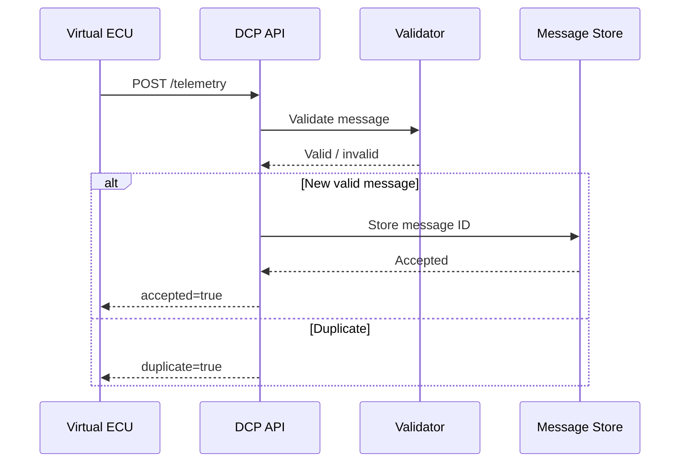
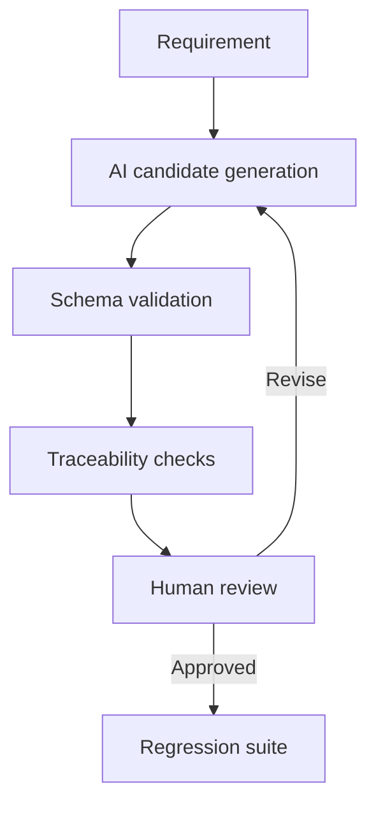

# Sequence Diagrams

```mermaid
sequenceDiagram
    participant ECU as Virtual ECU
    participant API as DCP API
    participant V as Validator
    participant S as Message Store
    ECU->>API: POST /telemetry
    API->>V: Validate message
    V-->>API: Valid / invalid
    alt New valid message
        API->>S: Store message ID
        S-->>API: Accepted
        API-->>ECU: accepted=true
    else Duplicate
        API-->>ECU: duplicate=true
    end
```

```mermaid
flowchart TD
    A[Requirement] --> B[AI candidate generation]
    B --> C[Schema validation]
    C --> D[Traceability checks]
    D --> E[Human review]
    E -->|Approved| F[Regression suite]
    E -->|Revise| B
```
